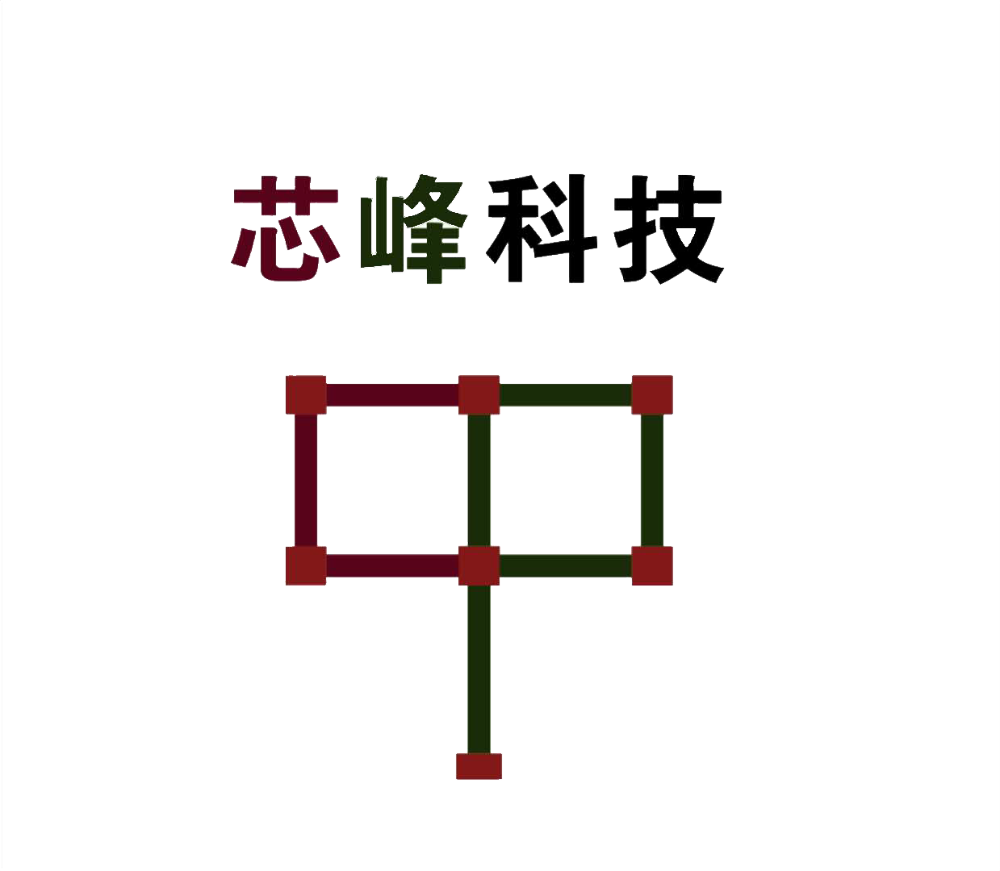

<div align="center">
  
  <center>

  [](https://pypi.org/project/ccdt/)
  [](https://github.com/540717421/chipeak_cv_data_tool/blob/main/LICENSE)

  </center>
</div>


## 简介
简体中文| [English](README_EN.md)

&nbsp;&nbsp;&nbsp;&nbsp;chipeak_cv_data_tool主要用于多种数据集(计算机视觉)格式之间的相互转换,如coco、labelme等。另外还集成数据、文件、视频等文件常用的处理功能。


## 主要特性
1. 集成多种计算机视觉标注格式相互转换
2. 支持各类数据集的筛选,分配与切割
3. 集成多种文件、图像、视频处理功能
4. 模块可拓展,用户可自定义数据格式
5. 提供python模块包,命令行等便捷方式

## 安装

pip install ccdt

## 快速入门
请参考[快速入门文档](docs/get_started.md)学习 chipeak_cv_data_tool 的基本使用。


## 相关标注工具
labelme:https://github.com/wkentaro/labelme

## 命令行功能实现
* 数据支持集格式：
    - [x] labelme格式数据集 https://github.com/wkentaro/labelme
    - [x] COCO格式数据集
* 数据处理功能：
    - [x] 数据集标注文件相互转换
    - [x] 截取目标保存为图像(目前支持:矩形框,)
* 图像(文件)处理：
    - [x] 按比例或者文件数目划分数据(列如:文件分配或者训练测试集划分)    
* 视频处理：
    - [x] 视频切片成图像
    - [x] 图像合成为视频

## python模块功能实现
* 数据支持集格式：
    - [x] labelme格式数据集 https://github.com/wkentaro/labelme
    - [x] COCO格式数据集
* 数据处理功能：
    - [x] 数据集标注文件相互转换
    - [x] 截取目标保存为图像(目前支持:矩形框,)
* 图像(文件)处理：
    - [x] 按比例或者文件数目划分数据(列如:用于文件分配或者训练测试集划分)
* 视频处理：
    - [x] 视频切片成图像
    - [x] 图像合成为视频

## 开源许可证

该项目采用 [GNU General Public License v3.0 开源许可证](LICENSE)。

## 更新日志

最新的月度版本 v1.0 在 2021.11.08 发布。

已支持的数据集：

- [x] COCO数据集
- [x] Via标注数据集
- [x] Labelme标注数据集


已更新的功能：

- [x] labelme数据集抠图
- [x] coco数据集转labelme数据集
- [x] labelme数据集转coco数据集
- [x] 根据标签类别筛选labelme数据集

## 贡献指南

无

## 致谢

无

## 引用

```
@misc{ccdt2021,
  author =       {詹勇，朱文海},
  title =        {{ccdt: Annotation conversion and file video processing tools}},
  howpublished = {url{https://github.com/540717421/chipeak_cv_data_tool}},
  year =         {2021}
}
```
## ChiPeak的其它项目

- [ccdt](https://github.com/540717421/chipeak_data_tool): chipeak_cv_data_tool AI数据处理工具箱


## 欢迎加入 ChiPeak 社区

扫描下方的二维码可关注 芯峰科技团队的 [官方网站](http://http://www.chipeak.com/)，加入芯峰科技 团队的 [官方交流](http://www.chipeak.com/account/login)
<div align="center">

</div>
我们会在 ChiPeak 社区为大家

- 📢 分享 AI 框架的前沿核心技术
- 💻 解读 ccdt 常用模块源码
- 📰 发布 ChiPeak 的相关新闻
- 🚀 介绍 ChiPeakDetection 开发的前沿算法
- 🏃 获取更高效的问题答疑和意见反馈
- 🔥 提供与各行各业开发者充分交流的平台

干货满满 📘，等你来撩 💗，ChiPeak 社区期待您的加入 👬

